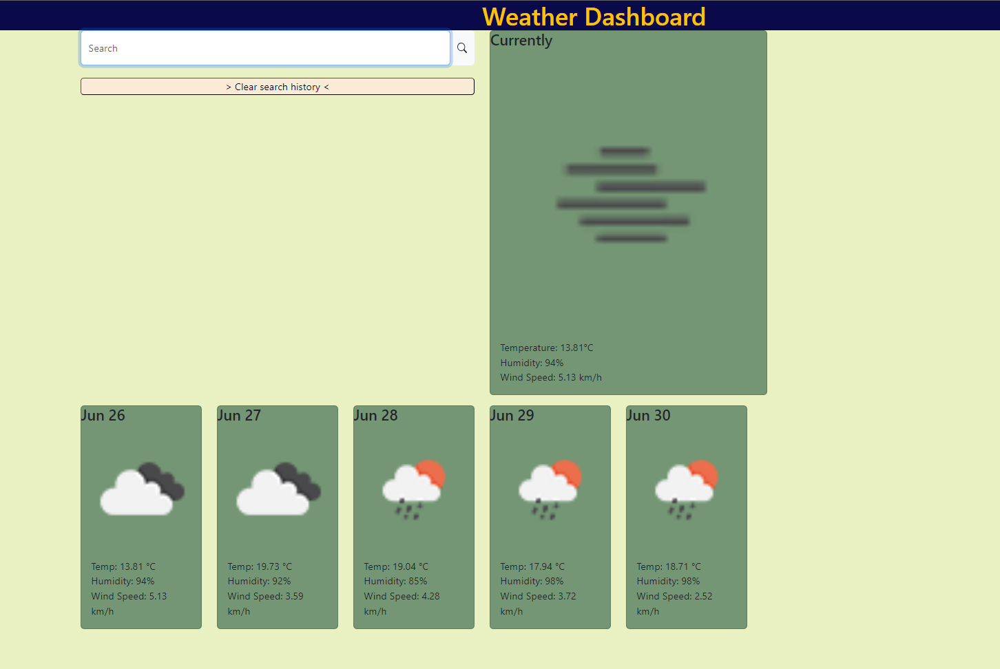
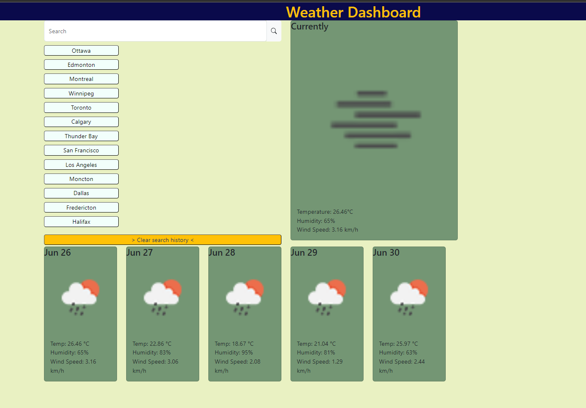
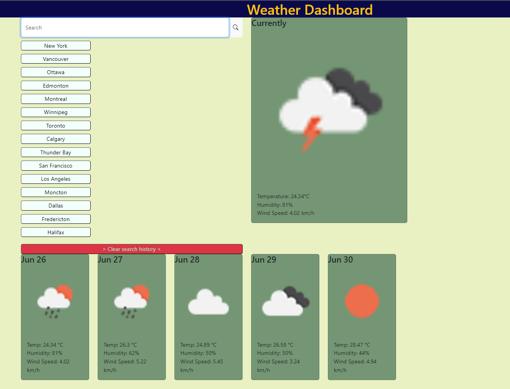

# Weather App

A simple weather application that displays current weather information and a 5-day forecast for a given city.

## Features

- Search for a city to view its current weather and 5-day forecast.
- Display current temperature, humidity, and wind speed.
- Display weather icons corresponding to the current weather condition.
- Store search history in local storage for easy access.

## Screenshots

## Technologies Used

- HTML
- CSS
- JavaScript
- Bootstrap
- jQuery
- Day.js
- OpenWeatherMap API

## Getting Started

Simply go to [this](https://YggdrasilJL.github.io/weather-app/) site.

## Usage

- Enter a city name in the search input field and press Enter to view the weather information.
- Click on a city from the search history list to view its weather information.
- The current temperature, humidity, and wind speed are displayed in the "Currently" card.
- The 5-day forecast is displayed in separate cards, each showing the date, weather icon, temperature, humidity, and wind speed for that day.
- The search history is stored in the browser's local storage, allowing easy access to previously searched cities.

# Credits
---
## This project was made by Jacob Lowther.
   
  ---
 #
https://openweathermap.org/api

https://getbootstrap.com/docs/5.3/getting-started/introduction/
